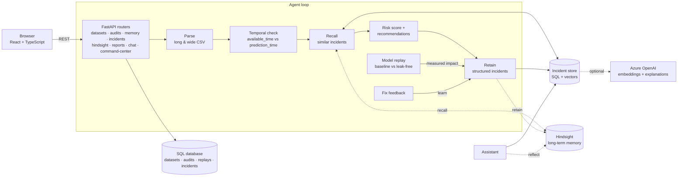

# ChronoGuard

**An AI Reliability Engineer that remembers every ML failure and prevents the next one.**

ChronoGuard audits machine-learning training data for *temporal leakage* (information from the future),
measures how much it inflated the model, and retains every incident in long-term memory. When the same
failure comes back, in another model, another team or under another column name, ChronoGuard recognises it
before the model ships, recommends the fix that worked last time, and learns from whether it worked again.

- **Live API:** https://chronoguard-pt4n.onrender.com/docs (free tier, so the first request may take up to a minute while it wakes up)
- **Sample datasets:** [`backend/data/samples/`](backend/data/samples) (synthetic, reproducible). They can also be downloaded in the app.

---

## The problem

A model can only use what was known at the moment it made a prediction. Training tables are usually built
later, by joining data that arrived *after* the decision: a fraud confirmation recorded two weeks after the
card transaction, a payment state finalised days later, an investigation outcome closed a month later. The
model learns from the future, offline metrics look excellent, and production performance collapses.

Finding the leak once is not the hard part. **Organisations keep repeating it.** The next model iteration, a
different team, or a rebuilt feature table joins the same post-outcome signal again under a new name
(`fraud_confirmed` becomes `confirmed_fraud_flag`, `cb_resolution_flag` becomes `chargeback_resolution`). The
knowledge of what went wrong last time lives in a post-mortem nobody reads.

## Why memory matters

A stateless auditor treats every dataset as the first one it has ever seen. ChronoGuard keeps an incident
memory and runs a **retain → recall → learn** loop around every audit:

| Step | What happens | Where |
|---|---|---|
| **Retain** | Each leaked feature becomes a structured incident: incident type, dataset, model, feature, cause, timeline evidence (a real decision and its timestamps), fix, measured impact from the replay, recurrence link, fix feedback and lesson. | SQL incident store (source of truth) and Hindsight (`retain`, one document per incident, replaced in place when it changes) |
| **Recall** | Before scoring a new dataset, the agent searches memory for incidents similar to its features and shows *Similar incidents remembered* with similarity, the past fix, and whether that fix worked. Recalled matches raise the risk score and turn into recommendations such as *Remove confirmed_fraud_flag, investigation_outcome, chargeback_resolution and payment_final_status before training.* | Vector search over incidents; Hindsight `recall` for organisational context |
| **Learn** | After an audit the team answers **“Was this fix successful?”**. The answer is written onto this dataset's incidents *and* every remembered incident the audit recalled, and re-retained into Hindsight. Future recalls say “that fix was confirmed to work 1 time(s)”, or warn that it did not. | `POST /api/audits/{id}/feedback`; Hindsight `retain` (replace) |

The assistant can also ask Hindsight to **reflect** over everything retained (“Have we seen this failure
before?”), and labels those answers as such.

### How Hindsight improves the agent

The SQL store answers *“which past feature looks like this one?”*. [Hindsight](https://hindsight.vectorize.io)
adds organisational memory on top: it extracts facts and entities from each retained incident record, so
recall can surface related knowledge (a model, a data source, a past fix) and `reflect` can reason across all
incidents rather than one match at a time. Each record carries metadata (`dataset`, `model`, `feature`,
fix counts) and tags (`temporal-leakage`, `feature:…`, `model:…`) and a stable document id, so feedback
updates the memory instead of duplicating it.

Hindsight is optional. Without credentials ChronoGuard runs entirely on its local incident store, and the UI
says so. Every Hindsight call is bounded by a timeout and fails closed.

## What you see

| Page | What it shows |
|---|---|
| **Command Center** | KPIs (models protected, incidents learned, prevented failures, memory confidence), an animated neural view of the memory, and the guided 5-scene demo |
| **Audit Intelligence** | The agent's recorded reasoning (*Understanding dataset → Checking temporal availability → Searching N previous ML incidents → Generating recommendation → Retaining lessons*), similar incidents remembered, recommendations, the feedback prompt, and the full evidence (risk gauge, leakage timeline, delay histogram, per-feature evidence, affected decisions) |
| **Memory Brain** | Memory graph (past incident → failure pattern → new detection), Hindsight status and reflect, memory search, every incident with its fix and fix confidence |
| **Incident Timeline** | Every incident learned, recall, replay and fix confirmation, with an incident detail panel including the exact record retained in Hindsight |
| **Model Replay** | Before vs after on a time-ordered split, with the explanation *the previous score was inflated because future information was used* |
| **Reports** | One-click audit report: executive summary, risk score, evidence, timeline, replay, memory references, recommended fixes. Download as Markdown or print to PDF |
| **Ask ChronoGuard** | An assistant grounded in the audit and memory (“Why was this feature risky?”, “Have we seen this before?”, “What should I fix first?”), with citations |

Every metric, chart, score and explanation is computed by the backend from the uploaded data. KPIs are plain
counts over stored rows: *models protected* = distinct model names audited; *prevented failures* = leaked
features whose recommended fix the team confirmed; *memory confidence* = (confirmed + 1) / (fix reports + 2),
shown as “—” until there is feedback.

## Architecture



- **Deterministic core.** Parsing, detection, scoring, replay, recommendations and the assistant's answers are
  plain Python (pandas and scikit-learn). The same file always gives the same result.
- **Facts in SQL.** Datasets, audits (including the agent trace, recall and recommendations), replays and
  incidents are stored in SQLite by default or any SQLAlchemy database. New columns are added to existing
  databases automatically on start.
- **AI where it helps, never for the numbers.** Local vectors run offline. Azure OpenAI, when configured, adds
  semantic embeddings and explanations grounded in the measured facts. Hindsight adds long-term memory. The UI
  always shows which provider produced a text.

Backend layout: `api/routers/` (one module per area), `engine/` (parse, detect, score, replay), `memory/`
(incident records, store, Hindsight adapter, graph, assistant), `reports/` (report builder), `models/`,
`database/`, `scripts/generate_samples.py`.

## Tech stack

| Layer | Technology |
|---|---|
| Frontend | React 19, TypeScript, Vite, Tailwind CSS 4, Framer Motion, Recharts, TanStack Query, React Router |
| Backend | Python 3.11, FastAPI, Pydantic, SQLAlchemy 2 |
| Analysis | pandas, NumPy, scikit-learn (`HistGradientBoostingClassifier`, hashed text vectors) |
| Memory | Incident store in SQL with vector search; optional Hindsight (`hindsight-client`); optional Azure OpenAI embeddings |
| Storage | SQLite (default) or PostgreSQL |
| Quality | pytest, ruff, TypeScript strict build, oxlint |

## How it works

1. **Parse.** CSVs in *long* (one row per decision and feature) or *wide* (one row per decision) layout are
   detected automatically. Timestamps without a timezone are treated as UTC. In the wide layout, identifier
   columns (`customer_id`, `merchant_id`, …) and raw event timestamps are not features. Verdict-like columns
   are listed as ignored and never used as evidence.
2. **Detect.** For every (decision, feature) value: `delay = available_time − prediction_time`; it leaks if
   `delay > 0`. Per feature: leak rate and min/median/p90/max delay. Per dataset: distinct affected decisions,
   a timeline for one real decision, and a delay histogram.
3. **Recall.** Each feature is compared with incidents from *other* datasets by cosine similarity (match ≥ 0.50
   with local vectors, ≥ 0.60 with Azure embeddings). When Hindsight is configured it is queried too.
4. **Score and recommend.**
   ```
   feature score = 100 × √(leak rate) × severity(median delay) + memory boost (≤ 15 × similarity)
   severity      = 0.5 + 0.5 × min(1, log(1 + median delay h) / log(1 + 720))
   dataset score = 0.7 × max(feature scores) + 0.3 × mean(risky feature scores)
   bands         = low < 25 ≤ medium < 60 ≤ high
   ```
   A feature that leaks in at least half of decisions is recommended for removal; one that leaks only
   occasionally (a late batch job) is recommended to use its point-in-time value. Recommendations cite the
   remembered incident and its fix feedback.
5. **Retain.** Each leaked feature becomes a structured incident, stored in SQL and retained into Hindsight.
6. **Replay.** Decisions are sorted by time; two identical models train on the earliest 70% and are tested on
   the latest 30%, one with all features and one without the leaked ones. A drop-one ablation measures each
   leaked feature's own contribution; when leaked fields carry the same signal, the UI explains that removing
   one alone looks harmless while removing all of them does not. The measured impact is written back into
   the incidents.
7. **Learn.** Fix feedback updates the incidents and their Hindsight records.

## Demo: one failure, remembered (about 3 minutes)

On first start the backend audits two **synthetic** history datasets (a retail forecast with future sales
joined in, and a clean credit model), so memory has some experience. The fraud story is then played from the
Command Center, one button per scene. Every number below was measured on the bundled synthetic data.

1. **Model v1 ships with a hidden leak.** Audit `fraud_model_v1.csv` (7,200 transactions, 32 columns). The
   agent searches memory, finds nothing similar, and flags `fraud_confirmed`, `payment_final_state`,
   `investigation_result`, `cb_resolution_flag` (all post-outcome) plus `merchant_risk_score` (late in 12% of
   rows). Risk 94/100. Five incidents are retained.
2. **Replay: the score was a lie.** ROC-AUC 1.000 → 0.826 and accuracy 99.9% → 90.3% on the same held-out
   period. *The previous score was inflated because future information was used.*
3. **The team confirms the fix.** Answer *Yes, it worked*. The confirmation is stored on all five incidents.
4. **Weeks later, model v2 arrives.** Another team rebuilt the table and renamed every leaky column. The agent
   recalls all five past incidents (64–100% similar), each carrying the confirmed fix, and recommends:
   *Remove confirmed_fraud_flag, investigation_outcome, chargeback_resolution and payment_final_status before
   training.*
5. **One-click report.** Open the report for v2: executive summary, evidence, timeline, memory references and
   fixes, ready for the ticket.

Ask the assistant “Why was this feature risky?” or “Have we seen this failure before?” at any point, and open
**Memory Brain** to see the v2 detection linked to the patterns learned from v1.

The data is generated by [`backend/scripts/generate_samples.py`](backend/scripts/generate_samples.py) (seeded,
reproducible). Leakage verdicts are never stored in the files; ChronoGuard derives them from the timestamps.

## Run locally

**Backend** (Python 3.11+):

```bash
cd backend
python -m venv .venv
source .venv/bin/activate            # Windows: .venv\Scripts\activate
pip install -r requirements-dev.txt
uvicorn main:app --reload            # API docs at /docs on port 8000
```

**Frontend** (Node 20+), in a second terminal:

```bash
cd frontend
npm install
npm run dev                          # opens on port 5173
```

In development, leave `VITE_API_URL` unset. The Vite dev server proxies `/api` to the local backend
(override with `DEV_API_PROXY_TARGET`).

**Checks:**

```bash
cd backend && pytest && ruff check . && ruff format --check .
cd frontend && npm run build && npm run lint
```

## Deployment

**Backend on Render.** The settings are recorded in [`render.yaml`](render.yaml):

| Setting | Value |
|---|---|
| Root directory | `backend` |
| Build command | `pip install -r requirements.txt` |
| Start command | `uvicorn main:app --host 0.0.0.0 --port $PORT` |
| Health check | `/api/health` |
| Environment | `PYTHON_VERSION=3.11.15`; optionally `CHRONOGUARD_CORS_ORIGINS=https://<your-frontend>` |

Render's free-tier disk is ephemeral: the SQLite database resets on restart and the samples are re-seeded
automatically. For persistent history, set `CHRONOGUARD_DATABASE_URL` to a PostgreSQL database.

**Frontend on any static host.**

| Setting | Value |
|---|---|
| Root directory | `frontend` |
| Build command | `npm ci && npm run build` |
| Output directory | `dist` |
| Environment | `VITE_API_URL=https://chronoguard-pt4n.onrender.com` (**required** at build time) |

Single-page-app rewrites are included for Vercel (`vercel.json`), Netlify (`public/_redirects`) and Render
(`render.yaml`), so deep links like `/audits/3` or `/reports/4` work after a refresh. A production build without
`VITE_API_URL` shows a clear configuration error instead of calling a wrong address.

## Configuration and security

- All settings are environment variables. See [`backend/.env.example`](backend/.env.example) and
  [`frontend/.env.example`](frontend/.env.example). Real `.env` files are git-ignored. No keys are in the
  repository.
- Azure OpenAI and Hindsight keys belong in the hosting provider's secret settings only.
- CORS defaults to `*` because the API uses no cookies or credentials. Set `CHRONOGUARD_CORS_ORIGINS` to your
  frontend URL to restrict it.
- Uploads are limited to `.csv` files of at most 20 MB (`CHRONOGUARD_MAX_UPLOAD_MB`). File names are sanitised
  and stored outside the web root.
- The demo has **no authentication**: anyone with the URL can upload and see audits. Do not upload
  confidential data to a public deployment.

**Optional integrations:**

| Integration | Enables | Settings |
|---|---|---|
| Azure OpenAI | Semantic embeddings for memory; written explanations grounded in measured facts | `CHRONOGUARD_AZURE_OPENAI_*` |
| Hindsight | Long-term organizational recall alongside the SQL incident store | `CHRONOGUARD_HINDSIGHT_BASE_URL` (e.g. `https://api.hindsight.vectorize.io`) + `CHRONOGUARD_HINDSIGHT_API_KEY` |
| PostgreSQL | Durable, shared storage | `CHRONOGUARD_DATABASE_URL` + `pip install "psycopg[binary]"` |

The active providers are shown in the app's sidebar and at `GET /api/health`. For Hindsight, health reports
`disabled` (not configured), `package_missing`, `configured` (connection not checked yet), `connected` or
`connection_failed`, with a reason in `hindsight_detail`. The check is a cached background probe (at most once
a minute, 3 s timeout), so the health endpoint stays fast. Every Hindsight call is bounded by
`CHRONOGUARD_HINDSIGHT_TIMEOUT_SECONDS` (default 10) and fails closed: audits and local memory keep working.

## Dataset format

**Long layout:**

```csv
decision_id,feature_name,feature_value,prediction_time,available_time,target
TXN-001,chargeback_filed,1,2026-01-10T10:00:00Z,2026-01-17T15:00:00Z,1
TXN-001,transaction_amount,84.20,2026-01-10T10:00:00Z,2026-01-10T10:00:00Z,1
```

**Wide layout** (one `<feature>_available_time` column per feature):

```csv
transaction_id,scored_at,is_fraud,amount,amount_available_time,cb_flag,cb_flag_available_time
TX-1,2026-01-10T10:00:00Z,1,84.20,2026-01-10T10:00:00Z,1,2026-01-17T15:00:00Z
```

A binary `target` column (`target`, `label`, `is_fraud`, …) enables the replay.

## API

| Method | Path | Purpose |
|---|---|---|
| GET | `/api/health` | Database status and active memory, explanation and Hindsight providers |
| GET | `/api/command-center` · `/api/dashboard` | KPIs and aggregates across all audits |
| POST | `/api/datasets` | Upload a CSV (multipart `file`, optional `model_name`) and get the full audit |
| GET | `/api/samples` | List bundled samples |
| POST | `/api/samples/{name}/audit` · GET `/api/samples/{name}/download` | Audit or download a sample |
| GET | `/api/audits` · `/api/audits/{id}` | Audit summaries and full audits (agent trace, recall, recommendations, feedback) |
| GET | `/api/audits/{id}/affected` | Paginated affected decision IDs |
| POST / GET | `/api/audits/{id}/replay` | Run a replay / latest replay (`null` if none yet) |
| POST | `/api/audits/{id}/feedback` | `{"successful": true, "note": "…"}`: was the fix successful? |
| GET | `/api/incidents` · `/api/incidents/{id}` | Structured incidents; detail with recurrences, recalling audits and the Hindsight record |
| GET | `/api/memory/graph` · `/api/memory/timeline` | Memory graph and memory events |
| GET | `/api/memory/incidents` · POST `/api/memory/search` | Incident list (legacy path) and similarity search |
| GET | `/api/hindsight/status` · POST `/api/hindsight/recall` · POST `/api/hindsight/reflect` | Hindsight state and direct recall/reflect |
| GET | `/api/reports/{audit_id}` · `/api/reports/{audit_id}/download` | Audit report (JSON with Markdown, or a `.md` file) |
| POST | `/api/chat` | `{"message": "…", "audit_id": 4}`: grounded assistant answer with citations |

Interactive documentation is served at `/docs` on the API.

## Limitations

- ChronoGuard is only as accurate as the availability timestamps it is given. If a pipeline records when a
  value was *backfilled* rather than when it became *known*, the audit inherits that error.
- Offline memory matches renames that share words or common abbreviations. Pure synonyms
  (`payment_final_state` vs `settlement_status`) need Azure OpenAI embeddings.
- The assistant answers from templates over the stored evidence; it does not hold an open-ended conversation.
- Fix feedback is self-reported by the team and not verified against production metrics.
- The replay measures the impact on one standard model class, not on the team's original model.

## Future improvements

- **Pipeline integration:** a CLI and CI check (`chronoguard audit data.csv --fail-on high`) so leaky
  training tables are blocked before training.
- **Point-in-time rebuild:** instead of dropping leaked features, rebuild them from the last value known at
  prediction time (as-of joins) and replay again.
- **Direct connectors** to feature stores and warehouses (Feast, Databricks, Azure Synapse) to read
  availability metadata without CSV exports.
- **Workspaces and authentication** (Microsoft Entra ID) so each team has its own private incident memory.
- **Replay with the team's own model** (MLflow or ONNX) instead of the standard baseline model.
- **Leakage beyond time:** detect target proxies and train/test identity overlap next to temporal leakage.
