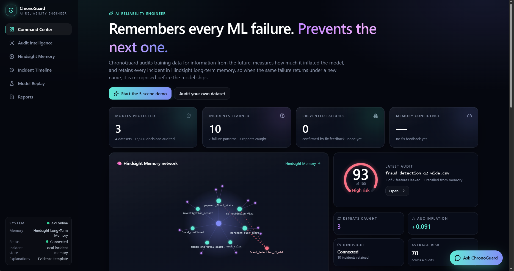
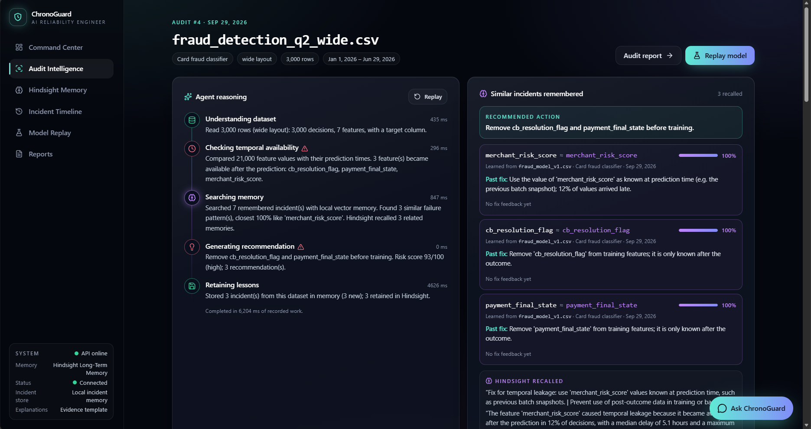
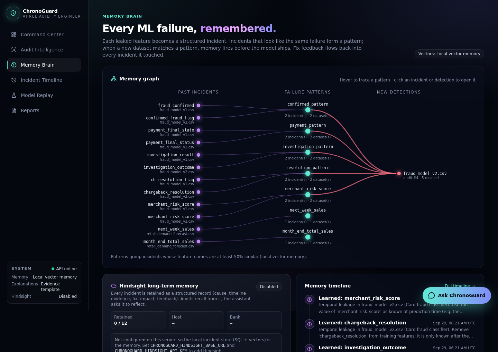
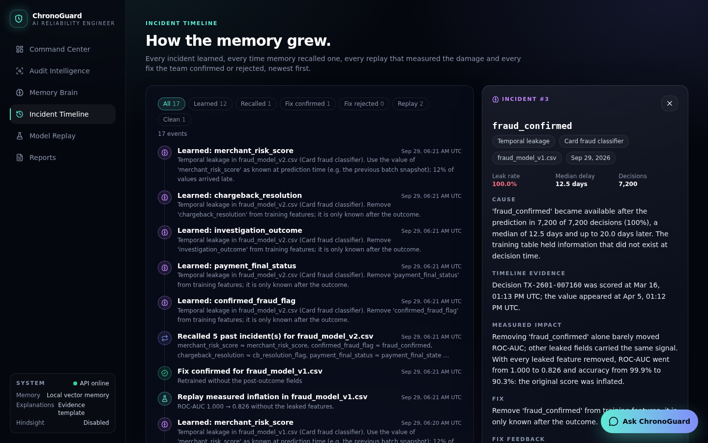
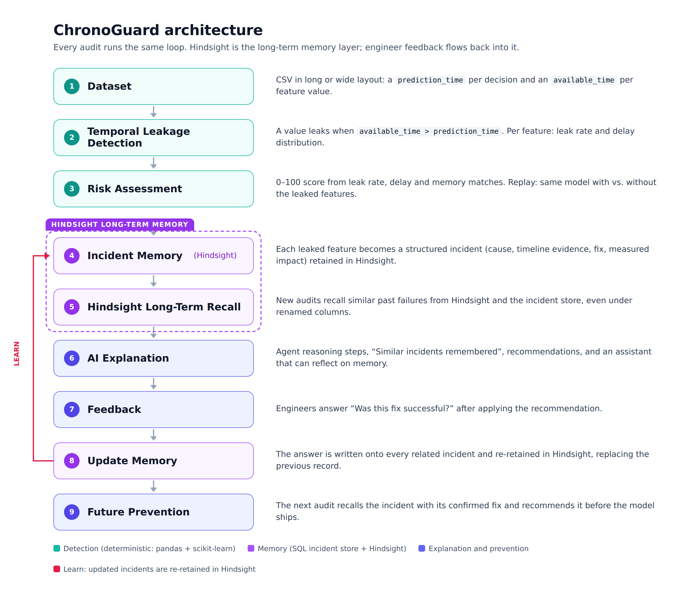
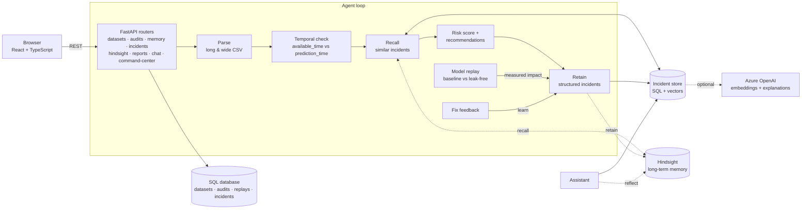

# ⚡ ChronoGuard

### AI Reliability Engineer That Learns From Every ML Failure

> ## “ChronoGuard has seen this failure before.”

ChronoGuard is an **AI agent** that audits machine-learning training data for **reliability failures**, starting
with one of the most expensive and most repeated: *temporal leakage*, where a model trains on information that
did not exist yet when its prediction was made.

- **It detects failures.** It checks every feature value against the moment each prediction was made, scores
  the risk, and replays the model without the leak to measure the real damage.
- **[Hindsight](https://hindsight.vectorize.io) is its long-term memory layer.** Every reliability incident
  becomes reusable knowledge that can be recalled when similar failures appear again: cause, evidence, fix,
  impact and engineer feedback.
- **It learns from previous incidents.** Before auditing a new dataset it recalls similar past failures, even
  under renamed columns, and recommends the fix that worked last time.

**Detect → Remember → Recall → Explain → Learn**

| | |
|---|---|
| **Live app** | https://chronoguard-ochre.vercel.app/ |
| **Live API** | https://chronoguard-pt4n.onrender.com/docs (free tier: the first request may take up to a minute while it wakes up) |
| **Hindsight** | 🟢 Connected: long-term incident memory active (host `api.hindsight.vectorize.io`, bank `chronoguard`) |
| **Sample datasets** | [`backend/data/samples/`](backend/data/samples) (synthetic, reproducible; also downloadable in the app) |

**Contents:** [Hindsight Memory Layer](#-hindsight-memory-layer) · [Demo story](#-demo-story) ·
[Problem](#the-problem) · [Memory advantage](#-the-memory-advantage) ·
[Learning loop](#-hindsight-learning-loop) · [Hindsight integration](#-hindsight-integration) ·
[Screenshots](#-product-screenshots) · [Architecture](#architecture) · [Run locally](#run-locally) · [API](#api)

---

## 🧠 Hindsight Memory Layer

ChronoGuard uses Hindsight as its long-term memory layer. Every reliability incident becomes reusable knowledge
that can be recalled when similar failures appear again.

ChronoGuard does not forget previous ML failures. Every detected reliability incident is stored as structured
memory:

- **Failure type:** e.g. temporal leakage
- **Dataset context:** the dataset and the model it came from
- **Leaked feature:** the exact column
- **Evidence timeline:** a real decision with its prediction and availability timestamps
- **Root cause:** how late the value arrived, and why it is post-outcome information
- **Recommended fix:** remove the feature, or use its value as known at prediction time
- **Fix validation feedback:** how many times engineers confirmed or rejected the fix

When a new model is audited, Hindsight recalls similar historical failures and helps ChronoGuard recommend
previously successful fixes.

```text
Detect Failure
      ↓
Store Incident in Hindsight
      ↓
Recall Similar Failures
      ↓
Explain Risk
      ↓
Recommend Proven Fix
      ↓
Learn From Feedback
```

## 📊 Demo Story

> ## “ChronoGuard has seen this failure before.”

```text
Model V1
   ↓
Temporal leakage detected
   ↓
Incident stored in Hindsight
   ↓
Model V2 appears with renamed columns
   ↓
Hindsight recalls previous incidents
   ↓
ChronoGuard recommends the confirmed solution
```

A second team rebuilds the fraud model's feature table and renames every leaky column (`fraud_confirmed` →
`confirmed_fraud_flag`, `cb_resolution_flag` → `chargeback_resolution`, …). ChronoGuard still makes the
connection through memory:

> **“ChronoGuard has seen this failure before.”**
> Model v2's audit recalls all five incidents learned from v1 (64–100% similar), each carrying the fix the team
> confirmed, and recommends: *Remove confirmed_fraud_flag, investigation_outcome, chargeback_resolution and
> payment_final_status before training.*

| | Fraud model v1 | Fraud model v2 |
|---|---|---|
| Memory | Nothing similar found; 5 incidents retained | **All 5 recalled from v1**, with the confirmed fix |
| Risk | 94 / 100 | 96 / 100 (recurring leakage) |
| Replay | ROC-AUC 1.000 → 0.826, accuracy 99.9% → 90.3% without the leaked features: *the previous score was inflated because future information was used* | |

Measured live on the bundled synthetic datasets (`fraud_model_v1.csv`: 7,200 rows; `fraud_model_v2.csv`:
7,400 rows; generated by [`backend/scripts/generate_samples.py`](backend/scripts/generate_samples.py)).
**Try it:** in the app's Command Center, “The story: one failure, remembered” plays these scenes one button at a
time.

## The problem

A model can only use what was known at the moment it made a prediction. Training tables are usually built
later, by joining data that arrived *after* the decision: a fraud confirmation recorded two weeks after the
card transaction, a payment state finalised days later, an investigation outcome closed a month later. The
model learns from the future, offline metrics look excellent, and production performance collapses.

Finding the leak once is not the hard part. **Organisations keep repeating it.** The next model iteration, a
different team, or a rebuilt feature table joins the same post-outcome signal again under a new name
(`fraud_confirmed` becomes `confirmed_fraud_flag`, `cb_resolution_flag` becomes `chargeback_resolution`).

## 🧠 The Memory Advantage

Traditional AI reliability tools:

```text
Detect → Fix → Forget
```

ChronoGuard:

```text
Detect
  ↓
Remember with Hindsight
  ↓
Recall previous failures
  ↓
Explain with evidence
  ↓
Recommend proven fixes
  ↓
Continuously improve
```

| Step | What the agent does |
|---|---|
| **Detect** | Compares every feature value's availability time with its prediction time, using timestamps only (never hand-written labels), and scores the risk 0–100. |
| **Remember** | Turns each leaked feature into a structured incident and retains it in Hindsight. |
| **Recall** | Before scoring the next dataset, searches memory for similar past failures, even under new column names. |
| **Explain** | Shows the evidence (a real decision and its timestamps), replays the model with and without the leak, and answers questions such as “Why was this feature risky?” with citations. |
| **Learn** | Asks “Was this fix successful?” and attaches the answer to every related incident, so the next recommendation is better informed. |

Every metric, chart, score and explanation is computed by the backend from the uploaded data; nothing is
hard-coded.

## 🧠 Hindsight Learning Loop

### 1. Retain

ChronoGuard stores important reliability incidents.

Examples:

- Failure type (`Temporal leakage`)
- Suspicious feature (`fraud_confirmed`)
- Evidence (decision `TX-…` scored at 13:13, value available 20 days later)
- Root cause (available after the prediction in 100% of decisions)
- Recommended fix (“Remove 'fraud_confirmed' from training features; it is only known after the outcome.”)

### 2. Recall

When a new audit happens, the agent searches previous incidents for similar patterns. Matches appear as
**Similar incidents remembered**, with similarity, where the incident was learned, the past fix and its fix
confidence. They also raise the risk score and shape the recommendation.

### 3. Learn

Feedback from previous fixes improves future recommendations. After an audit the team answers **“Was this
fix successful?”**. The answer is written onto this dataset's incidents *and* onto every remembered incident
the audit recalled, then re-retained in Hindsight. Future recalls say “That fix was confirmed to work 1
time(s)”, or warn that the previous fix was reported as not working.

| Step | Where it happens |
|---|---|
| Retain | SQL incident store (source of truth) and Hindsight `retain`: one document per incident, replaced in place when it changes |
| Recall | Vector search over incidents, plus Hindsight `recall` for organisational context |
| Learn | `POST /api/audits/{id}/feedback`, then Hindsight `retain` (replace) for every affected incident |
| Reflect | The assistant asks Hindsight to `reflect` across all incidents for memory questions (“Have we seen this failure before?”) and labels those answers |

## 🔗 Hindsight Integration

ChronoGuard uses Hindsight as the long-term memory layer of the AI reliability agent.

Each incident is retained as a natural-language record that Hindsight extracts facts and entities from.
Stored memory includes:

- **Incident context:** incident type, model name, recurrence of an earlier incident
- **Dataset information:** the dataset the incident was learned from
- **Suspicious features:** the leaked feature
- **Leakage evidence:** a real decision with its prediction and availability timestamps
- **Risk information:** leak rate and delay, and the replay's measured ROC-AUC and accuracy impact
- **Root cause:** why the value is post-outcome information
- **Recommended fixes:** remove the feature, or use its value as known at prediction time
- **Validation feedback:** how many times the fix was confirmed or rejected

How it is wired (`backend/memory/hindsight_adapter.py`, `backend/memory/incidents.py`):

| Hindsight call | Used for |
|---|---|
| `retain(bank_id, content, context, document_id, metadata, tags, update_mode="replace")` | Every incident, after each audit, replay and feedback. A stable `document_id` (`chronoguard-incident-<dataset>-<feature>`) means updates replace the memory instead of duplicating it. Metadata: `dataset`, `model`, `feature`, `leak_rate`, fix counts. Tags: `chronoguard`, `temporal-leakage`, `feature:…`, `model:…` |
| `recall(bank_id, query)` | During each audit that finds leaks, and in memory search, to surface related organisational knowledge |
| `reflect(bank_id, query)` | Assistant memory questions and the Hindsight Memory Brain's *Reflect* box, reasoning across all incidents rather than one match at a time |

This transforms memory from simple storage into a **reliability learning loop**: the SQL store answers
“which past feature looks like this one?”, and Hindsight adds organisational memory that can reason across
every incident, fix and piece of feedback.

**In production.** Hindsight is connected at `api.hindsight.vectorize.io` with the `chronoguard` bank
(`GET /api/hindsight/status` reports `connected`), configured through `CHRONOGUARD_HINDSIGHT_BASE_URL` and
`CHRONOGUARD_HINDSIGHT_API_KEY` (see [Configuration](#configuration-and-security)). The sidebar shows the memory
layer and its live status.

**Resilience.** Every Hindsight call is bounded by a timeout and fails closed: if Hindsight is briefly
unreachable, audits keep running on the local incident store, the UI shows *Connection failed* instead of
pretending, and incidents are re-retained on their next update. The Hindsight client is exercised in the test
suite with a fake client that mirrors the real SDK's call signatures.

## 📸 Product Screenshots

**Production status: Hindsight Connected — Long-term incident memory active.**

The screenshots below were captured from the demo story on a local development instance before its Hindsight
key was set, so their sidebar status differs from production.

### Command Center

Shows overall reliability status and the guided demo flow: models protected, incidents learned, prevented
failures, memory confidence, and a live view of the memory.



### Audit Intelligence

Shows detection, reasoning steps and recalled incidents: model v2's leaks, the agent's recorded steps, and
**Similar incidents remembered** turned into a recommended action.



### 🧠 Hindsight Memory Brain

Shows how previous failures become reusable knowledge: past incidents group into failure patterns, and new
detections link back to what was learned from model v1.



### Incident Timeline

Shows how reliability knowledge grows over time: incidents learned, recalls, replays and confirmed fixes, with
one incident's cause, evidence, impact and fix.



### All pages

| Page | What it shows |
|---|---|
| **Command Center** | KPIs (models protected, incidents learned, prevented failures, memory confidence), an animated neural view of the memory, and the guided 5-scene demo |
| **Audit Intelligence** | The agent's recorded reasoning, similar incidents remembered, recommendations, the feedback prompt, and the full evidence (risk gauge, leakage timeline, delay histogram, per-feature evidence, affected decisions) |
| **Hindsight Memory Brain** | Memory graph (past incident → failure pattern → new detection), Hindsight status and reflect, memory search, every incident with its fix and fix confidence |
| **Incident Timeline** | Every incident learned, recall, replay and fix confirmation, with an incident detail panel including the exact record retained in Hindsight |
| **Model Replay** | Before vs after on a time-ordered split, with the explanation *the previous score was inflated because future information was used* |
| **Reports** | One-click audit report: executive summary, risk score, evidence, timeline, replay, memory references, recommended fixes. Download as Markdown or print to PDF |
| **Ask ChronoGuard** | An assistant grounded in the audit and memory (“Why was this feature risky?”, “Have we seen this before?”, “What should I fix first?”), with citations |

KPIs are plain counts over stored rows: *models protected* = distinct model names audited; *prevented
failures* = leaked features whose recommended fix the team confirmed; *memory confidence* = (confirmed + 1) /
(fix reports + 2), shown as “—” until there is feedback.

## Architecture



Component view:



- **Deterministic core.** Parsing, detection, scoring, replay, recommendations and the assistant's answers are
  plain Python (pandas and scikit-learn). The same file always gives the same result.
- **Facts in SQL.** Datasets, audits (including the agent trace, recall and recommendations), replays and
  incidents are stored in SQLite by default or any SQLAlchemy database. New columns are added to existing
  databases automatically on start.
- **AI where it helps, never for the numbers.** Local vectors run offline. Azure OpenAI, when configured, adds
  semantic embeddings and explanations grounded in the measured facts. Hindsight adds long-term memory. The UI
  always shows which provider produced a text.

Backend layout: `api/routers/` (one module per area), `engine/` (parse, detect, score, replay), `memory/`
(incident records, store, Hindsight adapter, graph, assistant), `reports/` (report builder), `models/`,
`database/`, `scripts/generate_samples.py`.

## Tech stack

| Layer | Technology |
|---|---|
| Frontend | React 19, TypeScript, Vite, Tailwind CSS 4, Framer Motion, Recharts, TanStack Query, React Router |
| Backend | Python 3.11, FastAPI, Pydantic, SQLAlchemy 2 |
| Analysis | pandas, NumPy, scikit-learn (`HistGradientBoostingClassifier`, hashed text vectors) |
| Memory | Hindsight long-term memory (`hindsight-client`) + local incident store in SQL with vector search; optional Azure OpenAI embeddings |
| Storage | SQLite (default) or PostgreSQL |
| Quality | pytest, ruff, TypeScript strict build, oxlint |

## How it works

1. **Parse.** CSVs in *long* (one row per decision and feature) or *wide* (one row per decision) layout are
   detected automatically. Timestamps without a timezone are treated as UTC. In the wide layout, identifier
   columns (`customer_id`, `merchant_id`, …) and raw event timestamps are not features. Verdict-like columns
   are listed as ignored and never used as evidence.
2. **Detect.** For every (decision, feature) value: `delay = available_time − prediction_time`; it leaks if
   `delay > 0`. Per feature: leak rate and min/median/p90/max delay. Per dataset: distinct affected decisions,
   a timeline for one real decision, and a delay histogram.
3. **Recall.** Each feature is compared with incidents from *other* datasets by cosine similarity (match ≥ 0.50
   with local vectors, ≥ 0.60 with Azure embeddings). When Hindsight is configured it is queried too.
4. **Score and recommend.**
   ```
   feature score = 100 × √(leak rate) × severity(median delay) + memory boost (≤ 15 × similarity)
   severity      = 0.5 + 0.5 × min(1, log(1 + median delay h) / log(1 + 720))
   dataset score = 0.7 × max(feature scores) + 0.3 × mean(risky feature scores)
   bands         = low < 25 ≤ medium < 60 ≤ high
   ```
   A feature that leaks in at least half of decisions is recommended for removal; one that leaks only
   occasionally (a late batch job) is recommended to use its point-in-time value. Recommendations cite the
   remembered incident and its fix feedback.
5. **Retain.** Each leaked feature becomes a structured incident, stored in SQL and retained into Hindsight.
6. **Replay.** Decisions are sorted by time; two identical models train on the earliest 70% and are tested on
   the latest 30%, one with all features and one without the leaked ones. A drop-one ablation measures each
   leaked feature's own contribution; when leaked fields carry the same signal, the UI explains that removing
   one alone looks harmless while removing all of them does not. The measured impact is written back into
   the incidents.
7. **Learn.** Fix feedback updates the incidents and their Hindsight records.

## Run locally

**Backend** (Python 3.11+):

```bash
cd backend
python -m venv .venv
source .venv/bin/activate            # Windows: .venv\Scripts\activate
pip install -r requirements-dev.txt
uvicorn main:app --reload            # API docs at /docs on port 8000
```

**Frontend** (Node 20+), in a second terminal:

```bash
cd frontend
npm install
npm run dev                          # opens on port 5173
```

In development, leave `VITE_API_URL` unset. The Vite dev server proxies `/api` to the local backend
(override with `DEV_API_PROXY_TARGET`).

**Checks:**

```bash
cd backend && pytest && ruff check . && ruff format --check .
cd frontend && npm run build && npm run lint
```

## Deployment

Production:

| Service | URL |
|---|---|
| Frontend (Vercel) | https://chronoguard-ochre.vercel.app/ |
| Backend API (Render) | https://chronoguard-pt4n.onrender.com (interactive docs at `/docs`) |

**Backend on Render.** The settings are recorded in [`render.yaml`](render.yaml):

| Setting | Value |
|---|---|
| Root directory | `backend` |
| Build command | `pip install -r requirements.txt` |
| Start command | `uvicorn main:app --host 0.0.0.0 --port $PORT` |
| Health check | `/api/health` |
| Environment | `PYTHON_VERSION=3.11.15`; optionally `CHRONOGUARD_CORS_ORIGINS=https://<your-frontend>` |

Render's free-tier disk is ephemeral: the SQLite database resets on restart and the samples are re-seeded
automatically. For persistent history, set `CHRONOGUARD_DATABASE_URL` to a PostgreSQL database.

**Frontend on Vercel** (or any static host).

| Setting | Value |
|---|---|
| Root directory | `frontend` |
| Build command | `npm ci && npm run build` |
| Output directory | `dist` |
| Environment | `VITE_API_URL=https://chronoguard-pt4n.onrender.com` (**required** at build time) |

Single-page-app rewrites are included for Vercel (`vercel.json`), Netlify (`public/_redirects`) and Render
(`render.yaml`), so deep links like `/audits/3` or `/reports/4` work after a refresh. A production build without
`VITE_API_URL` shows a clear configuration error instead of calling a wrong address.

## Configuration and security

- All settings are environment variables. See [`backend/.env.example`](backend/.env.example) and
  [`frontend/.env.example`](frontend/.env.example). Real `.env` files are git-ignored. No keys are in the
  repository.
- Azure OpenAI and Hindsight keys belong in the hosting provider's secret settings only.
- CORS defaults to `*` because the API uses no cookies or credentials. Set `CHRONOGUARD_CORS_ORIGINS` to your
  frontend URL to restrict it.
- Uploads are limited to `.csv` files of at most 20 MB (`CHRONOGUARD_MAX_UPLOAD_MB`). File names are sanitised
  and stored outside the web root.
- The demo has **no authentication**: anyone with the URL can upload and see audits. Do not upload
  confidential data to a public deployment.

**Integrations:**

| Integration | Role | Settings |
|---|---|---|
| Hindsight | **Long-term memory layer**: incidents are retained, recalled and reflected on across audits | `CHRONOGUARD_HINDSIGHT_BASE_URL` (`https://api.hindsight.vectorize.io`) + `CHRONOGUARD_HINDSIGHT_API_KEY` (+ `CHRONOGUARD_HINDSIGHT_BANK_ID`, default `chronoguard`) |
| Azure OpenAI (optional) | Semantic embeddings for the local incident store; written explanations grounded in measured facts | `CHRONOGUARD_AZURE_OPENAI_*` |
| PostgreSQL (optional) | Durable, shared storage | `CHRONOGUARD_DATABASE_URL` + `pip install "psycopg[binary]"` |

The active providers are shown in the app's sidebar and at `GET /api/health`. For Hindsight, health reports
`disabled` (not configured), `package_missing`, `configured` (connection not checked yet), `connected` or
`connection_failed`, with a reason in `hindsight_detail`. The check is a cached background probe (at most once
a minute, 3 s timeout), so the health endpoint stays fast. Every Hindsight call is bounded by
`CHRONOGUARD_HINDSIGHT_TIMEOUT_SECONDS` (default 10) and fails closed: audits and the local incident store keep
working. For local development without a Hindsight key, the same loop runs on the local incident store alone.

## Dataset format

**Long layout:**

```csv
decision_id,feature_name,feature_value,prediction_time,available_time,target
TXN-001,chargeback_filed,1,2026-01-10T10:00:00Z,2026-01-17T15:00:00Z,1
TXN-001,transaction_amount,84.20,2026-01-10T10:00:00Z,2026-01-10T10:00:00Z,1
```

**Wide layout** (one `<feature>_available_time` column per feature):

```csv
transaction_id,scored_at,is_fraud,amount,amount_available_time,cb_flag,cb_flag_available_time
TX-1,2026-01-10T10:00:00Z,1,84.20,2026-01-10T10:00:00Z,1,2026-01-17T15:00:00Z
```

A binary `target` column (`target`, `label`, `is_fraud`, …) enables the replay.

## API

| Method | Path | Purpose |
|---|---|---|
| GET | `/api/health` | Database status and active memory, explanation and Hindsight providers |
| GET | `/api/command-center` · `/api/dashboard` | KPIs and aggregates across all audits |
| POST | `/api/datasets` | Upload a CSV (multipart `file`, optional `model_name`) and get the full audit |
| GET | `/api/samples` | List bundled samples |
| POST | `/api/samples/{name}/audit` · GET `/api/samples/{name}/download` | Audit or download a sample |
| GET | `/api/audits` · `/api/audits/{id}` | Audit summaries and full audits (agent trace, recall, recommendations, feedback) |
| GET | `/api/audits/{id}/affected` | Paginated affected decision IDs |
| POST / GET | `/api/audits/{id}/replay` | Run a replay / latest replay (`null` if none yet) |
| POST | `/api/audits/{id}/feedback` | `{"successful": true, "note": "…"}`: was the fix successful? |
| GET | `/api/incidents` · `/api/incidents/{id}` | Structured incidents; detail with recurrences, recalling audits and the Hindsight record |
| GET | `/api/memory/graph` · `/api/memory/timeline` | Memory graph and memory events |
| GET | `/api/memory/incidents` · POST `/api/memory/search` | Incident list (legacy path) and similarity search |
| GET | `/api/hindsight/status` · POST `/api/hindsight/recall` · POST `/api/hindsight/reflect` | Hindsight state and direct recall/reflect |
| GET | `/api/reports/{audit_id}` · `/api/reports/{audit_id}/download` | Audit report (JSON with Markdown, or a `.md` file) |
| POST | `/api/chat` | `{"message": "…", "audit_id": 4}`: grounded assistant answer with citations |

Interactive documentation is served at `/docs` on the API.

## Limitations

- ChronoGuard is only as accurate as the availability timestamps it is given. If a pipeline records when a
  value was *backfilled* rather than when it became *known*, the audit inherits that error.
- Offline memory matches renames that share words or common abbreviations. Pure synonyms
  (`payment_final_state` vs `settlement_status`) need Azure OpenAI embeddings.
- The assistant answers from templates over the stored evidence; it does not hold an open-ended conversation.
- Fix feedback is self-reported by the team and not verified against production metrics.
- The replay measures the impact on one standard model class, not on the team's original model.

## Future improvements

- **Pipeline integration:** a CLI and CI check (`chronoguard audit data.csv --fail-on high`) so leaky
  training tables are blocked before training.
- **Point-in-time rebuild:** instead of dropping leaked features, rebuild them from the last value known at
  prediction time (as-of joins) and replay again.
- **Direct connectors** to feature stores and warehouses (Feast, Databricks, Azure Synapse) to read
  availability metadata without CSV exports.
- **Workspaces and authentication** (Microsoft Entra ID) so each team has its own private incident memory.
- **Replay with the team's own model** (MLflow or ONNX) instead of the standard baseline model.
- **Leakage beyond time:** detect target proxies and train/test identity overlap next to temporal leakage.
