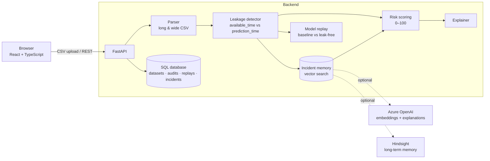

# ChronoGuard

**Your model should only know what the world knew.**

ChronoGuard audits machine-learning datasets for *temporal leakage*, measures how much it inflates a model's
performance, and remembers every incident so the same mistake is caught when it returns.

- **Live API:** https://chronoguard-pt4n.onrender.com/docs (free tier, so the first request may take up to a minute while it wakes up)
- **Sample datasets:** [`backend/data/samples/`](backend/data/samples). They can also be downloaded from the app's dashboard.

---

## The problem

A model can only use what was known at the moment it made a prediction. Training tables are usually built
later, by joining data that arrived *after* the decision:

- a chargeback flag recorded a week after the card transaction;
- a settlement status finalized two days later;
- an economic indicator revised after the fact.

The model learns from the future. Offline metrics look excellent, the model ships, and production performance
collapses. This **temporal leakage** is one of the most common and most expensive ML failures, and nothing in
a normal training pipeline flags it. It also recurs: the next team, or the next quarter's model, joins the same
signal under a new column name.

## The solution

ChronoGuard answers three questions for any dataset:

| Question | How ChronoGuard answers it |
|---|---|
| **Did the model see the future?** | Compares every feature value's availability time with the decision's prediction time. A value leaks when `available_time > prediction_time`. It uses timestamps only, never hand-written labels. |
| **How much did it matter?** | Replays the model on a time-ordered split with and without the leaked features and reports the **measured** drop in ROC-AUC, accuracy, precision, recall and F1. |
| **Have we seen this before?** | Stores every leak as an incident in a vector memory. A new dataset's columns are compared against past incidents, so a leak that returns under a new name (`cb_resolution_flag` ≈ `chargeback_filed`) is recognised and scored higher. |

Every number, chart, score and explanation in the UI is computed by the backend from the uploaded data.

## Architecture



- **Deterministic core.** Parsing, detection, scoring and replay are plain Python (pandas and scikit-learn).
  The same file always gives the same result.
- **Facts in SQL.** Datasets, audits, per-feature findings, replays and incidents (with their vectors) are
  stored in SQLite by default, or in any SQLAlchemy database such as Azure Database for PostgreSQL.
- **AI where it helps, never for the numbers.** Local vectors run offline. Azure OpenAI, when configured, adds
  semantic embeddings and writes explanations grounded only in the measured facts. The UI always shows which
  provider produced a text.

## Tech stack

| Layer | Technology |
|---|---|
| Frontend | React 19, TypeScript, Vite, Tailwind CSS 4, Framer Motion, Recharts, TanStack Query, React Router |
| Backend | Python 3.11, FastAPI, Pydantic, SQLAlchemy 2 |
| Analysis | pandas, NumPy, scikit-learn (`HistGradientBoostingClassifier`, hashed text vectors) |
| Memory | Vector search over incidents in SQL; optional Azure OpenAI embeddings; optional Hindsight |
| Storage | SQLite (default) or PostgreSQL |
| Hosting | Render (API); any static host for the frontend (Render, Vercel, Netlify) |
| Quality | pytest, ruff, TypeScript strict build, oxlint |

## How it works

1. **Parse.** CSVs in *long* (one row per decision and feature) or *wide* (one row per decision) layout
   are detected automatically, and common column names are recognised. Timestamps without a timezone are
   treated as UTC. Verdict-like columns (`expected_status`, `available_at_decision_time`, …) are listed as
   ignored and never used as evidence.
2. **Detect.** For every (decision, feature) value: `delay = available_time − prediction_time`, and it leaks if
   `delay > 0`. Per feature this gives the leak rate and min, median, 90th-percentile and max delay. For the
   dataset it gives distinct affected decisions (not rows), a timeline for one real decision, and a delay
   histogram.
3. **Recall.** Each column is compared with past incidents from *other* datasets by cosine similarity. A match
   is similarity ≥ 0.50 with local vectors, or ≥ 0.60 with Azure embeddings.
4. **Score.** The formula is shown in the UI:
   ```
   feature score = 100 × √(leak rate) × severity(median delay) + memory boost (≤ 15 × similarity)
   severity      = 0.5 + 0.5 × min(1, log(1 + median delay h) / log(1 + 720))
   dataset score = 0.7 × max(feature scores) + 0.3 × mean(risky feature scores)
   bands         = low < 25 ≤ medium < 60 ≤ high
   ```
   A feature with no timestamps but a strong memory match is flagged for review (scoring up to 45).
5. **Remember.** Each leaked feature becomes an incident with its evidence, a lesson and a vector.
6. **Replay.** Decisions are sorted by time. Two identical models train on the earliest 70% and are tested
   on the latest 30%: one with all features, one without the leaked ones. A drop-one ablation measures each
   leaked feature's own contribution. The replay needs a binary target and at least 200 labelled decisions;
   otherwise it explains why no replay was run.

## Demo (about 2 minutes)

The backend seeds three **synthetic** sample datasets on first start, so the app is never empty.

1. Open the app and press **Try the demo**. It audits `fraud_detection_q2_wide.csv`, next quarter's fraud
   model, with several columns renamed.
2. **Audit Results:** risk **89/100**. The timeline shows `cb_resolution_flag` arriving about 7 days after the
   prediction. Click the feature: the *Deterministic evidence* panel shows the timestamps, and the *Memory
   evidence* panel shows it is 57% similar to `chargeback_filed`, which leaked in the Q1 dataset. It is a
   **recurring leak**.
3. **Replay model → Run replay:** ROC-AUC falls from about 0.99 with all features to about 0.64 without the
   leaked ones. That is performance the model could never have had in production.
4. **Memory:** search `chargeback_status_final` to see how a column you are about to use matches past
   incidents.
5. Compare with **Credit default · clean** on the dashboard: risk 0 and no replay gap. ChronoGuard does not
   cry wolf.
6. Upload your own CSV, or download a sample from the dashboard, edit it and upload it.

The sample data is generated by [`backend/scripts/generate_samples.py`](backend/scripts/generate_samples.py)
(seeded, reproducible). Leakage verdicts are never stored in the files. ChronoGuard derives them from the
timestamps.

## Run locally

**Backend** (Python 3.11+):

```bash
cd backend
python -m venv .venv
source .venv/bin/activate            # Windows: .venv\Scripts\activate
pip install -r requirements-dev.txt
uvicorn main:app --reload            # API docs at /docs on port 8000
```

**Frontend** (Node 20+), in a second terminal:

```bash
cd frontend
npm install
npm run dev                          # opens on port 5173
```

In development, leave `VITE_API_URL` unset. The Vite dev server proxies `/api` to the local backend
(override with `DEV_API_PROXY_TARGET`).

**Checks:**

```bash
cd backend && pytest && ruff check . && ruff format --check .
cd frontend && npm run build && npm run lint
```

## Deployment

**Backend on Render.** The settings are recorded in [`render.yaml`](render.yaml):

| Setting | Value |
|---|---|
| Root directory | `backend` |
| Build command | `pip install -r requirements.txt` |
| Start command | `uvicorn main:app --host 0.0.0.0 --port $PORT` |
| Health check | `/api/health` |
| Environment | `PYTHON_VERSION=3.11.15`; optionally `CHRONOGUARD_CORS_ORIGINS=https://<your-frontend>` |

Render's free-tier disk is ephemeral: the SQLite database resets on restart and the samples are re-seeded
automatically. For persistent history, set `CHRONOGUARD_DATABASE_URL` to a PostgreSQL database.

**Frontend on any static host.**

| Setting | Value |
|---|---|
| Root directory | `frontend` |
| Build command | `npm ci && npm run build` |
| Output directory | `dist` |
| Environment | `VITE_API_URL=https://chronoguard-pt4n.onrender.com` (**required** at build time) |

Single-page-app rewrites are included for Vercel (`vercel.json`), Netlify (`public/_redirects`) and Render
(`render.yaml`), so deep links like `/audits/3` work after a refresh. A production build without
`VITE_API_URL` shows a clear configuration error instead of calling a wrong address.

## Configuration and security

- All settings are environment variables. See [`backend/.env.example`](backend/.env.example) and
  [`frontend/.env.example`](frontend/.env.example). Real `.env` files are git-ignored. No keys are in the
  repository.
- Azure OpenAI and Hindsight keys belong in the hosting provider's secret settings only.
- CORS defaults to `*` because the API uses no cookies or credentials. Set `CHRONOGUARD_CORS_ORIGINS` to your
  frontend URL to restrict it.
- Uploads are limited to `.csv` files of at most 20 MB (`CHRONOGUARD_MAX_UPLOAD_MB`). File names are sanitised
  and stored outside the web root.
- The demo has **no authentication**: anyone with the URL can upload and see audits. Do not upload
  confidential data to a public deployment.

**Optional integrations:**

| Integration | Enables | Settings |
|---|---|---|
| Azure OpenAI | Semantic embeddings for memory; written explanations grounded in measured facts | `CHRONOGUARD_AZURE_OPENAI_*` |
| Hindsight | Long-term organizational recall alongside the SQL incident store | `CHRONOGUARD_HINDSIGHT_*` + `pip install hindsight-client` |
| PostgreSQL | Durable, shared storage | `CHRONOGUARD_DATABASE_URL` + `pip install "psycopg[binary]"` |

The active providers are shown in the app's sidebar and at `GET /api/health`.

## Dataset format

**Long layout:**

```csv
decision_id,feature_name,feature_value,prediction_time,available_time,target
TXN-001,chargeback_filed,1,2026-01-10T10:00:00Z,2026-01-17T15:00:00Z,1
TXN-001,transaction_amount,84.20,2026-01-10T10:00:00Z,2026-01-10T10:00:00Z,1
```

**Wide layout** (one `<feature>_available_time` column per feature):

```csv
transaction_id,scored_at,is_fraud,amount,amount_available_time,cb_flag,cb_flag_available_time
TX-1,2026-01-10T10:00:00Z,1,84.20,2026-01-10T10:00:00Z,1,2026-01-17T15:00:00Z
```

A binary `target` column (`target`, `label`, `is_fraud`, …) enables the replay.

## API

| Method | Path | Purpose |
|---|---|---|
| GET | `/api/health` | Database status and active memory, explanation and Hindsight providers |
| POST | `/api/datasets` | Upload a CSV (multipart `file`) and get the full audit |
| GET | `/api/samples` | List bundled samples |
| POST | `/api/samples/{name}/audit` | Audit a bundled sample |
| GET | `/api/samples/{name}/download` | Download a bundled sample |
| GET | `/api/audits` · `/api/audits/{id}` | Audit summaries and full reports |
| GET | `/api/audits/{id}/affected` | Paginated affected decision IDs |
| POST / GET | `/api/audits/{id}/replay` | Run a replay / latest replay (`null` if none yet) |
| GET | `/api/memory/incidents` · POST `/api/memory/search` | Incident memory |
| GET | `/api/dashboard` | Aggregates across all audits |

Interactive documentation is served at `/docs` on the API.

## Limitations

- ChronoGuard is only as accurate as the availability timestamps it is given. If a pipeline records when a
  value was *backfilled* rather than when it became *known*, the audit inherits that error.
- Offline memory matches renames that share words or common abbreviations. Pure synonyms
  (`payment_final_state` vs `settlement_status`) need Azure OpenAI embeddings.
- The replay measures the impact on one standard model class, not on the team's original model.

## Future improvements

- **Pipeline integration:** a CLI and CI check (`chronoguard audit data.csv --fail-on high`) so leaky
  training tables are blocked before training.
- **Point-in-time rebuild:** instead of dropping leaked features, rebuild them from the last value known at
  prediction time (as-of joins) and replay again.
- **Direct connectors** to feature stores and warehouses (Feast, Databricks, Azure Synapse) to read
  availability metadata without CSV exports.
- **Workspaces and authentication** (Microsoft Entra ID) so each team has its own private incident memory.
- **Replay with the team's own model** (MLflow or ONNX) instead of the standard baseline model.
- **Leakage beyond time:** detect target proxies and train/test identity overlap next to temporal leakage.
